# RStudio IDE Plumber Integration
## RStudio v1.2

[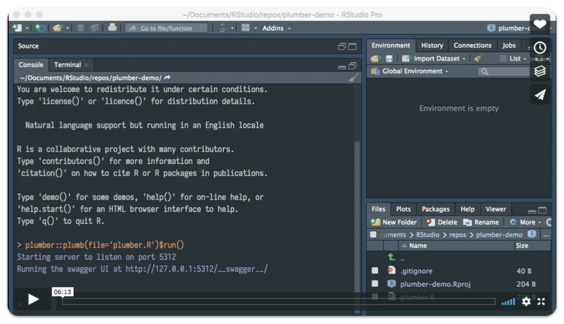](https://vimeo.com/276227327)

The R [plumber package](https://www.rplumber.io) provides methods for easily converting existing R functions into REST API endpoints. This is a useful convention for exposing R processes as a service to external applications. This framework becomes especially powerful when handing off assets created in R to non-R users for integration with other systems. For example, handing off a statistical model built in R to a dev-ops team has traditionally involved some form of re-write to convert R code into something that integrates with the desired endpoint. With plumber the model can be used as is and accessed via API calls.

The latest version of the RStudio IDE includes support for plumber APIs. A new R project can be created around plumber APIs by selecting “New Plumber API Project” from the Project Type dialogue when creating a new project.

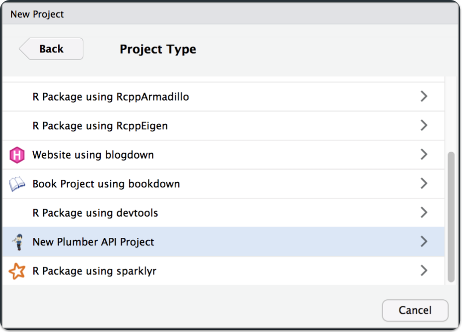

This creates a barebones plumber API script titled `plumber.R` that provides a few examples of endpoints defined in R. It is important to note that, as showcased in the example script, multiple endpoints can be defined in a single file.

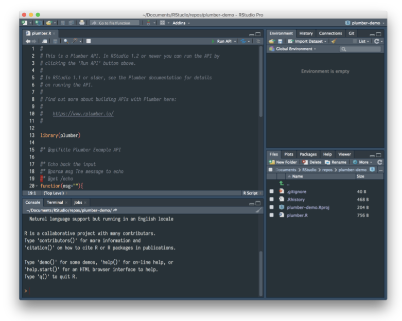

When an R script containing plumber endpoints is open, the RStudio IDE provides a “Run API” button in the top right corner of the source pane.

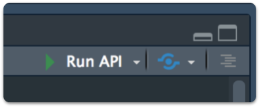

Clicking on this button will start a local web server to host the API and open an external window that provides access to the API via [swagger](https://swagger.io) documentation. The publish button next to the Run API button allows push button deployment of plumber APIs to [RStudio Connect](https://www.rstudio.com/products/connect/).

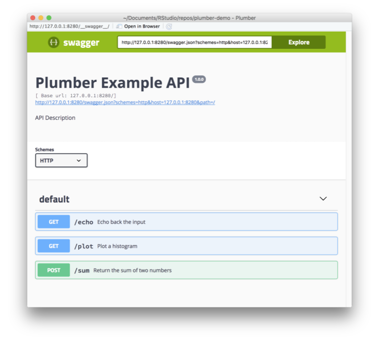

This is a great way to test and interact with the API endpoint. It should be noted that while R is serving the API, it can be interacted with in any way the user chooses. For example, opening a web browser pointed at an endpoint will show the results of that endpoint.

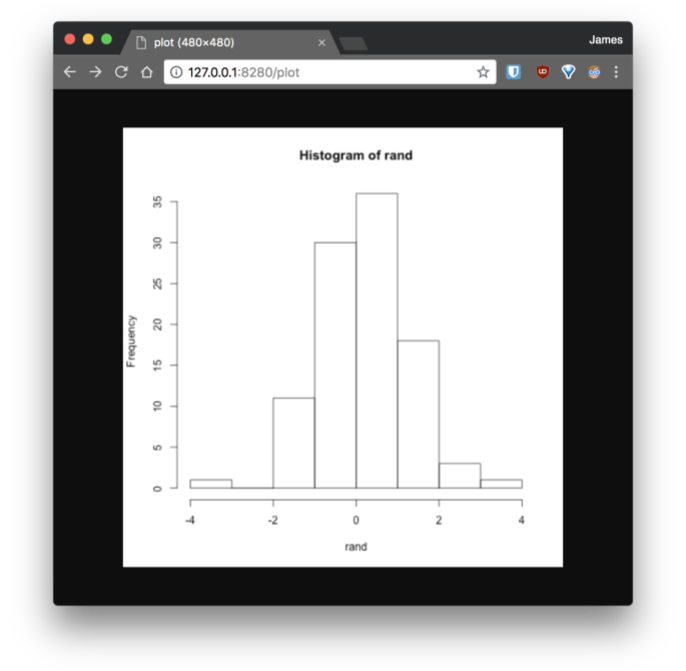
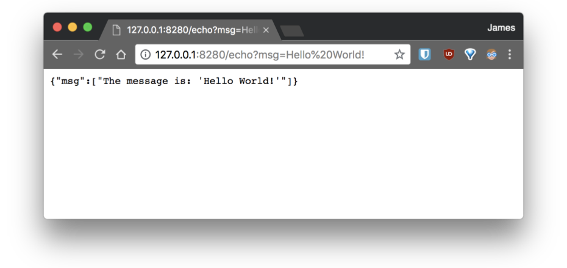

The user can also make a request to the endpoint using curl.

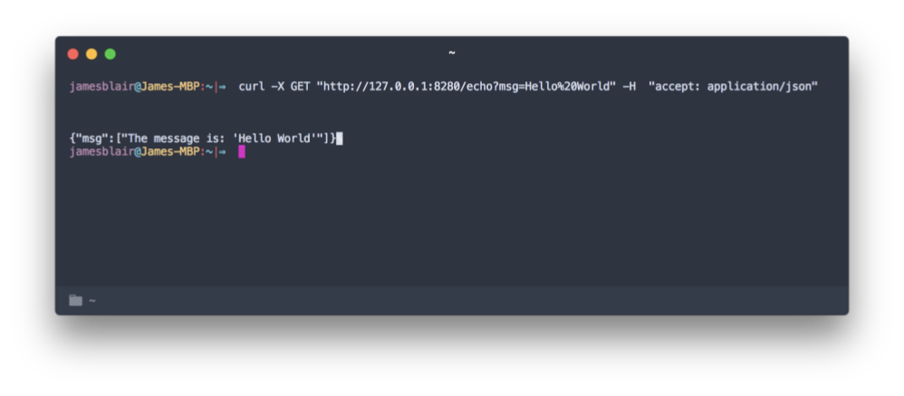

In addition to creating RStudio projects based on plumber, existing projects can also include plumber endpoints. The new file dropdown in RStudio includes an option to create a new Plumber API.

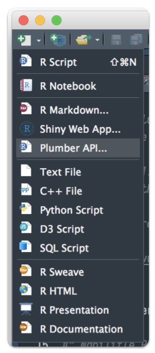

When this option is selected, a dialogue box appears that allows the user to name the API and choose its parent directory. The dialogue box also contains a link to plumber documentation. 

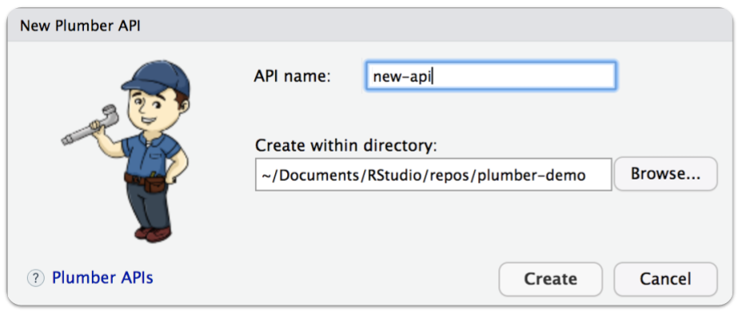

Once the user fills in the appropriate fields, a subdirectory named after the API is created and populated with a `plumber.R` script containing the basic example of endpoints as previously described.

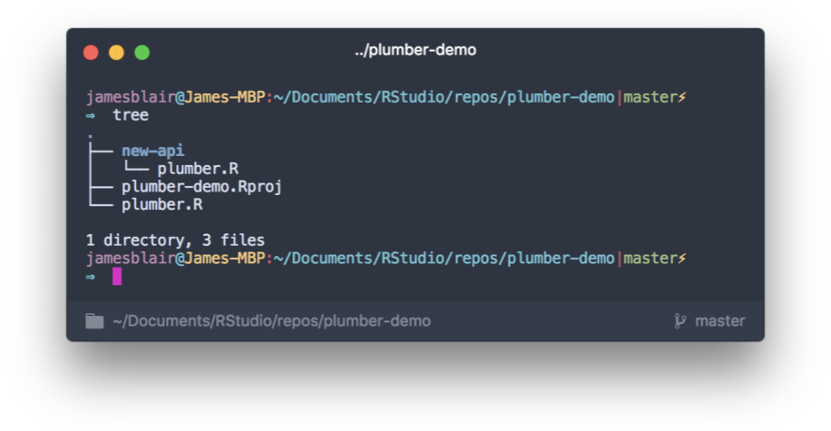

Detailed information and documentation about plumber can be found [here](https://www.rplumber.io/).